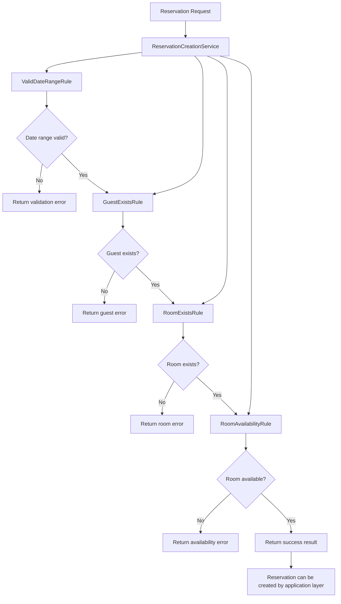

# Flow: Create Reservation with Strategy Pattern

```mermaid
flowchart TD
    A[Reservation Request] --> B[ReservationCreationService]

    B --> C[ValidDateRangeRule]
    B --> D[GuestExistsRule]
    B --> E[RoomExistsRule]
    B --> F[RoomAvailabilityRule]

    C --> G{Date range valid?}
    D --> H{Guest exists?}
    E --> I{Room exists?}
    F --> J{Room available?}

    G -- No --> K[Return validation error]
    H -- No --> L[Return guest error]
    I -- No --> M[Return room error]
    J -- No --> N[Return availability error]

    G -- Yes --> D
    H -- Yes --> E
    I -- Yes --> F
    J -- Yes --> O[Return success result]

    O --> P[Reservation can be created by application layer]
```
